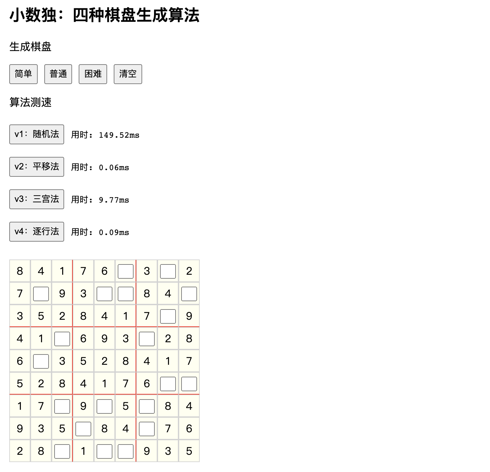

# Js小数独：四种棋盘生成法

## 生成测速 ⏱️（1000次挖50空）
- v1 随机法：140ms
- v2 平移法：0.06ms
- v3 三宫法：9.00ms
- v4 逐行法：0.09ms

## 算法讲述 🧮
### v1: 随机法
1. 建立空的棋盘，用二维数组
2. 生成1-9的数组，填入对角线三个宫格
3. 遍历剩下的格子，每次从行列宫中可用数字里，随机填一个
4. 若走到“死格”（无可用数字），则从第一个格，重新开始
5. 直到试出一种方法，把棋盘填满 （会重来几百到几千次不等）

### v2: 平移法
1. 生成第一行
2. 剩下的行，把第一行，依次向左平移[3,6,1,4,7,2,5,8]位
3. 即可得到，合法的棋盘

### v3: 三宫法
1. 生成对角的三个宫格
2. 遍历剩下的，每次从行列宫中，获取全部可用数字
3. 存储每格的“备用数字”
4. 若到“死格”则回溯，从上一格的“备用数字”中，换一个填入
5. 最终填完整个棋盘

### v4: 逐行法
1. 从第一格开始遍历，依次逐行
2. 存储每格的“备用数字”
3. 若到”死格“，则回到上一格，更换数字
4. 回溯时，清空路过的格子
5. 最终填完整个棋盘

### v5: 最终优化
- 创建空棋盘
  - 用硬编码取代遍历
- 获取单宫格
  - 用坐标计算取代遍历
- 回溯数组
  - 法1: 直接修剪回溯数组，每次需 pop push length （时间复杂度高）
  - 法2: 用额外k指针，在回溯数组中移动 （采取）
- 构造可用数组
  - 旧方法: 分别获取行列宫，合并三数组，再用1-9减去
  - 改进1: 因获取列需要遍历，正好与获取的行比对一遍，
  - [] 法2: 不合并
- 抽取可用数字
  - [] 法1: 从数组随机抽取
  - [] 法2: 把数组整体打乱

## 谢谢阅读 ☘️
制作时间三周，2021.7.19至2021.8.06；   
在大鹏老师，指导带领下完成；  
欢迎任何订正或建议，  
祝度过愉快的一天！  

